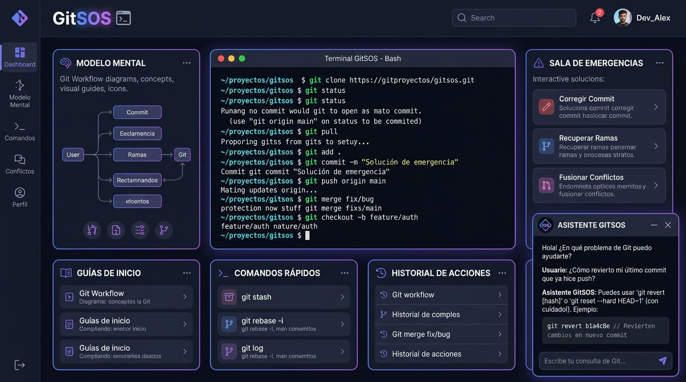

# 🚀 GitSOS — Guía Interactiva & Asistente de Rescate con IA

[](https://astro.build/)
[](https://react.dev/)
[](https://tailwindcss.com/)
[](https://sdk.vercel.ai/)
[](https://ai.google.dev/)
[](./LICENSE)

> **GitSOS** es una plataforma interactiva y asistente inteligente diseñada para transformar la curva de aprendizaje de Git y GitHub en una experiencia visual, clara y libre de frustraciones para desarrolladores junior y estudiantes de tecnología.

---

<p align="center">
  
</p>

---

## 📌 Tabla de Contenidos

- [💡 Visión y Propósito](#-visión-y-propósito)
- [✨ Características Principales](#-características-principales)
- [🛠️ Stack Tecnológico](#️-stack-tecnológico)
- [🏛️ Arquitectura del Sistema](#️-arquitectura-del-sistema)
- [📂 Estructura del Proyecto](#-estructura-del-proyecto)
- [🧭 Módulos de Aprendizaje (8 Rutas Anti-Frustración)](#-módulos-de-aprendizaje-8-rutas-anti-frustración)
- [⚡ Instalación y Uso Local](#-instalación-y-uso-local)
- [👩‍💻 Autora](#-autora)
- [📄 Licencia](#-licencia)

---

## 💡 Visión y Propósito

El control de versiones es una de las competencias más críticas del desarrollo de software moderno, pero también representa una de las mayores fuentes de ansiedad para quienes dan sus primeros pasos en la industria. Conceptos abstractos como el árbol de commits, la disociación entre local y remoto o los temidos *merge conflicts* suelen generar bloqueos y pérdida accidental de trabajo.

**GitSOS** aborda este desafío desde dos frentes complementarios:
1. **Didáctica Visual Basada en Casos Reales:** Documentación modular estructurada en 8 rutas de aprendizaje paso a paso, enriquecida con diagramas interactivos de las zonas de Git y explicaciones respaldadas por los estándares oficiales de [git-scm.com](https://git-scm.com).
2. **Asistencia en Tiempo Real (Senior AI Companion):** Un chatbot contextual alimentado por Google Gemini que diagnostica errores, entrega comandos precisos y ofrece contención técnica paso a paso ante cualquier emergencia en la terminal.

---

## ✨ Características Principales

### 🤖 Asistente de Rescate con IA (Google Gemini + Vercel AI SDK)
- **Streaming de Respuestas en Tiempo Real:** Integración fluida mediante `@ai-sdk/react` (`useChat`) y `@ai-sdk/google` que genera soluciones interactivas sin latencia percibida.
- **System Prompt Riguroso y Empático:** Diseñado para asumir el rol de un *Senior Developer* enfocado en transmitir calma, acotar sus respuestas al ecosistema Git/GitHub y entregar comandos verificables con sus conceptos técnicos en inglés (*working directory*, *staging area*, etc.).
- **Quick Action Chips:** Botones de acceso rápido para resolver las dudas y accidentes más frecuentes con un solo clic (*"Subí un archivo .env"*, *"Commit en la rama equivocada"*, *"Tengo un Merge Conflict"*).

### 📚 Motor de Contenido Dinámico MDX & Content Collections
- **Colecciones Tipadas con Zod:** Configuración moderna en `src/content.config.ts` utilizando el `glob` loader de Astro para garantizar validación de esquema en tiempo de compilación.
- **Componentes React Interactivos Embebidos:** Capacidad de insertar widgets e infografías dinámicas (como el diagrama `GitZonesDiagram`) directamente dentro de los archivos `.mdx`.

### 🍱 Diseño Mobile First con Bento Grid
- **Dashboard Modular:** Disposición visual inspirada en Bento Grid en la vista principal (`index.astro`), organizando módulos de aprendizaje y accesos rápidos mediante tarjetas limpias con alto contraste.
- **Navegación Móvil Adaptativa:** Drawer lateral deslizable con transiciones fluidas, menús táctiles optimizados y overlays de fondo para una experiencia natural en pantallas pequeñas.

### 💻 UI Personalizada con Estilo Terminal macOS
- **Bloques de Código Estilizados:** Componentes de código con cabecera superior y botones *traffic lights* al estilo macOS (rojo, amarillo y verde).
- **Copiado al Portapapeles con un Clic:** Botón interactivo de copia rápida con estado de confirmación visual (`Check` / `Copy`) tanto en el chat de IA como en los artículos de documentación.
- **Paleta Slate & Neón:** Entorno de modo oscuro profundo (`slate-950`), resaltados sintácticos en verde esmeralda e índigo, y tipografía monoespaciada para una lectura técnica cómoda.

---

## 🛠️ Stack Tecnológico

| Capa | Tecnología | Versión | Descripción y Razón de Elección |
| :--- | :--- | :--- | :--- |
| **Framework Base** | [Astro](https://astro.build/) | `v7.1.6` | Motor de generación estática y server-side rendering híbrido con arquitectura de islas. |
| **Integración UI** | [React](https://react.dev/) | `v19.2.8` | Biblioteca para componentes interactivos de alta fidelidad (Chat, diagramas, menús). |
| **Estilos** | [Tailwind CSS](https://tailwindcss.com/) | `v4.3.3` | Motor de utilidades CSS de última generación compilado a través de `@tailwindcss/vite`. |
| **Tipografía** | [@tailwindcss/typography](https://tailwindcss.com/docs/typography-plugin) | `v0.5.20` | Formato editorial impecable para bloques de lectura `.prose`. |
| **Orquestación IA** | [Vercel AI SDK](https://sdk.vercel.ai/) | `v7.0.67` | Abstracción unificada para streaming y gestión del ciclo de vida del chat en React. |
| **Modelo LLM** | [Google Gemini](https://ai.google.dev/) | `gemini-3.6-flash` | Modelo de lenguaje ultrarrápido con amplia ventana de contexto y bajo costo operativo. |
| **Contenido Técnico** | [@astrojs/mdx](https://docs.astro.build/en/guides/integrations-guide/mdx/) | `v7.0.5` | Extensión de Markdown que permite combinar prosa enriquecida con componentes React. |
| **Iconografía** | [Lucide React](https://lucide.dev/) | `v1.28.0` | Set de iconos vectoriales ligeros, consistentes y altamente personalizables. |
| **Markdown Parser** | [React Markdown](https://github.com/remarkjs/react-markdown) | `v10.1.0` | Renderizado seguro de Markdown y extensiones GFM dentro de los globos del chat. |
| **Despliegue / SSR** | [@astrojs/vercel](https://docs.astro.build/en/guides/integrations-guide/vercel/) | `v11.0.5` | Adaptador serverless para ejecución del endpoint `/api/chat` en la infraestructura de Vercel. |

---

## 🏛️ Arquitectura del Sistema

```
                        ┌─────────────────────────────────────────────────┐
                        │             Navegador / Cliente                 │
                        └───────────────────────┬─────────────────────────┘
                                                │
                 ┌──────────────────────────────┴─────────────────────────────┐
                 ▼                                                           ▼
    ┌──────────────────────────┐                                ┌──────────────────────────┐
    │  Documentación Estática  │                                │  Isla React (client:load)│
    │  Astro SSG (Prerendered) │                                │  src/components/         │
    │  HTML / CSS Ultraligero  │                                │  GitSOSInterface.tsx     │
    └──────────────────────────┘                                └─────────────┬────────────┘
                                                                              │
                                                                       POST /api/chat
                                                                    (Vercel AI SDK Stream)
                                                                              │
                                                                              ▼
                                                                ┌──────────────────────────┐
                                                                │ Endpoint Serverless Astro│
                                                                │  src/pages/api/chat.ts   │
                                                                └─────────────┬────────────┘
                                                                              │
                                                                  Google Generative AI API
                                                                    (Gemini 3.6 Flash)
                                                                              │
                                                                              ▼
                                                                ┌──────────────────────────┐
                                                                │   Stream de Respuestas   │
                                                                │     Modelo "Senior"      │
                                                                └──────────────────────────┘
```

1. **Astro Islands (Hidratación Selectiva):** Las páginas estáticas se sirven con cero JavaScript por defecto. Únicamente la interfaz del chat (`GitSOSInterface`) y los diagramas interactivos se hidratan en el cliente mediante la directiva `client:load`.
2. **Renderizado Híbrido:** La configuración `output: 'server'` en `astro.config.mjs` habilita funciones backend dinámicas para la API de chat, mientras que las páginas de contenido en `src/pages/docs/[...slug].astro` utilizan `export const prerender = true;` para servirse a la velocidad de la luz vía CDN.
3. **Seguridad en la Invocación del Modelo:** La API Key de Google Gemini reside exclusivamente en el entorno del servidor y nunca se expone al frontend.

---

## 📂 Estructura del Proyecto

```text
GitSOS/
├── .env.example                  # Plantilla de variables de entorno requeridas
├── AGENTS.md                     # Directrices operativas de desarrollo para agentes IA
├── astro.config.mjs              # Configuración de Astro, Tailwind (Vite), React y Vercel
├── LICENSE                       # Licencia MIT oficial
├── package.json                  # Metadatos del proyecto, scripts y dependencias
├── tsconfig.json                 # Configuración de compilación TypeScript
│
├── docs/                         # Documentación técnica interna y especificaciones
│   ├── arquitectura-asistente.md # Diseño técnico del pipeline del chatbot y prompts
│   ├── especificacion-proyecto.md# Especificación funcional, modelo mental y roadmap
│   └── preview.jpg               # Captura de pantalla de la interfaz para documentación
│
├── public/                       # Recursos estáticos servidos directamente
│   ├── favicon.svg               # Isotipo vectorial de GitSOS
│   └── preview.jpg               # Previsualización en alta resolución de la UI
│
└── src/
    ├── components/               # Componentes de UI e Islas de React
    │   ├── GitSOSInterface.tsx   # Layout principal interactivo: Sidebar, Header y Chatbot IA
    │   ├── GitZonesDiagram.tsx   # Diagrama interactivo de las 3 Zonas de Git para MDX
    │   └── Sidebar.astro         # Componente auxiliar de navegación
    │
    ├── content/                  # Colecciones de contenido y documentación técnica
    │   └── docs/                 # Los 8 módulos pedagógicos en formato MDX
    │       ├── modelo-mental.mdx
    │       ├── flujo-diario.mdx
    │       ├── colaboracion-remota.mdx
    │       ├── flujo-ramas-nube.mdx
    │       ├── multiverso-despliegues.mdx
    │       ├── introduccion-cicd.mdx
    │       ├── sala-emergencias.mdx
    │       └── glosario-bibliografia.mdx
    │
    ├── content.config.ts         # Definición de colecciones y validación de esquemas (Zod)
    ├── layouts/                  # Plantillas de envoltura para páginas
    │   └── DocLayout.astro       # Layout base para la renderización de artículos MDX
    ├── pages/                    # Enrutamiento de la aplicación (SSR + SSG)
    │   ├── api/
    │   │   └── chat.ts           # Endpoint SSR para streaming con Google Gemini
    │   ├── docs/
    │   │   └── [...slug].astro   # Ruta dinámica SSG para los 8 módulos MDX
    │   └── index.astro           # Landing page principal con Bento Grid
    └── styles/                   # Estilos globales de la aplicación
        └── global.css            # Directivas y extensiones de Tailwind CSS v4
```

---

## 🧭 Módulos de Aprendizaje (8 Rutas Anti-Frustración)

El plan formativo de **GitSOS** está organizado en 8 módulos exhaustivos diseñados para construir un modelo mental robusto y eliminar el temor a la terminal:

| # | Módulo | Ruta | Conceptos Clave Tratados |
| :-: | :--- | :--- | :--- |
| **01** | **El Modelo Mental de Git** | [`/docs/modelo-mental`](src/content/docs/modelo-mental.mdx) | Arquitectura de *snapshots*, Git local vs. plataformas en la nube, y dominio de las tres zonas (*Working Directory*, *Staging Area*, *Local Repository*). |
| **02** | **El Flujo Diario de Trabajo** | [`/docs/flujo-diario`](src/content/docs/flujo-diario.mdx) | Inicialización con `git init`, ciclo de vida local, `git status`, confirmaciones atómicas y estándares de *Conventional Commits*. |
| **03** | **Colaboración Remota** | [`/docs/colaboracion-remota`](src/content/docs/colaboracion-remota.mdx) | Conexión con GitHub y GitLab, gestión de claves SSH y tokens de acceso personal (PAT), comandos `git remote`, `git push` y `git pull`. |
| **04** | **Flujo de Ramas en la Nube** | [`/docs/flujo-ramas-nube`](src/content/docs/flujo-ramas-nube.mdx) | Flujos colaborativos en equipo, bifurcación de repositorios (*forks*), apertura y revisión de *Pull Requests* y *Merge Requests*. |
| **05** | **Multiverso y Despliegues** | [`/docs/multiverso-despliegues`](src/content/docs/multiverso-despliegues.mdx) | Creación y alternancia de ramas ligeras (`git branch`, `git switch`), fusiones con `git merge` y aislamiento de nuevas funcionalidades. |
| **06** | **Introducción a CI/CD** | [`/docs/introduccion-cicd`](src/content/docs/introduccion-cicd.mdx) | Fundamentos de integración y despliegue continuo, pipelines automatizados con GitHub Actions y GitLab CI/CD para ingenieros junior. |
| **07** | **La Sala de Emergencias** | [`/docs/sala-emergencias`](src/content/docs/sala-emergencias.mdx) | Primeros auxilios técnicos: corregir mensajes con `git commit --amend`, mover commits con `cherry-pick`, uso de `git stash`, recuperar variables `.env` y resolución guiada de *Merge Conflicts*. |
| **08** | **Glosario & Bibliografía Oficial** | [`/docs/glosario-bibliografia`](src/content/docs/glosario-bibliografia.mdx) | Diccionario de terminología técnica en español e inglés, definiciones oficiales y bibliografía académica respaldada en *git-scm.com*. |

---

## ⚡ Instalación y Uso Local

Sigue estos pasos para clonar y ejecutar GitSOS en tu entorno de desarrollo local:

### 1. Prerrequisitos
- **Node.js:** Versión `>= 22.12.0` (indicada en `package.json`).
- **Gestor de paquetes:** `npm` (incluido con Node) o `pnpm`.
- **API Key de Google Gemini:** Clave gratuita obtenible en [Google AI Studio](https://aistudio.google.com/).

### 2. Clonar el Repositorio
```bash
git clone https://github.com/KLGomez/GitSOS.git
cd GitSOS
```

### 3. Instalar Dependencias
```bash
npm install
```

### 4. Configurar Variables de Entorno
Copia la plantilla de variables de entorno:

```bash
cp .env.example .env
```

Abre `.env` y añade tu clave de API de Google Gemini:
```env
GOOGLE_GENERATIVE_AI_API_KEY=tu_api_key_de_gemini_aqui
```

### 5. Iniciar el Servidor de Desarrollo
```bash
npm run dev
```

La aplicación estará disponible de inmediato en [http://localhost:4321](http://localhost:4321).

> **💡 Tip de Desarrollo:** Si deseas iniciar el servidor de Astro en segundo plano según las directrices del proyecto, utiliza:
> ```bash
> npx astro dev --background
> ```
> Administra el proceso con `npx astro dev status`, `npx astro dev logs` y `npx astro dev stop`.

### 6. Scripts Disponibles

| Comando | Acción |
| :--- | :--- |
| `npm run dev` | Inicia el entorno local de desarrollo con Hot Module Replacement (HMR). |
| `npm run build` | Compila los assets estáticos y empaqueta las funciones serverless en `/dist`. |
| `npm run preview` | Previsualiza localmente el build de producción antes de desplegar. |
| `npm run astro ...` | Ejecuta comandos nativos del CLI de Astro (ej. `astro check`). |

---

## 👩‍💻 Autora

**Katherine Gomez**  
- Portfolio / GitHub: [@KLGomez](https://github.com/KLGomez)  
- Proyecto: [GitSOS Repository](https://github.com/KLGomez/GitSOS)

---

## 📄 Licencia

Este proyecto está distribuido bajo la **Licencia MIT**. Consulta el archivo [LICENSE](./LICENSE) para más detalles.

---

<p align="center">
  Hecho con ❤️, Astro y Gemini para que nunca más tengas miedo de abrir una terminal.
</p>
